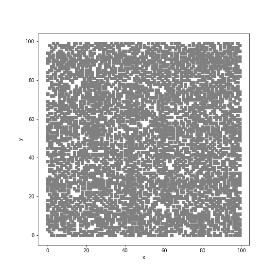

# ising-metropolis-simulator
Iterative simulation of spin lattice using Metropolis algorithm

This program simulates the formation of spin domains on a two-dimensional lattice. Each site on the lattice of 100x100 points hosts one spin which can adopt two values (up or down). Initially, the lattice is filled randomly with spins pointing up or down, respectively. A spin on a certain lattice site may be energetically unstable due to the interaction with neighboring spins and undergo a spin flip.

Starting from the initial (random) spin configuration, the simulator employs the [Metropolis algorithm](https://en.wikipedia.org/wiki/Metropolis%E2%80%93Hastings_algorithm) to iteratively find more and more stable spin configurations.

The output of the simulator (ising-simulator.c) is a file containing tupels of (iteration#, x-position, y-position) of spins of one orientation (lattice sites that are not contained in the output have opposite spin). A python script (ising-convert-data-to-images.py) converts the output file (ising-output.dat) into a series of images. The above gif shows the images of the output.

Files:

ising-simulator.c
ising-output.dat
ising-convert-data-to-images.py
ising.gif
